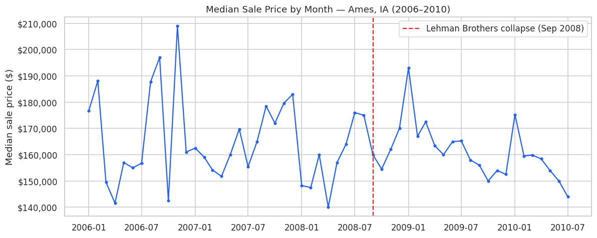
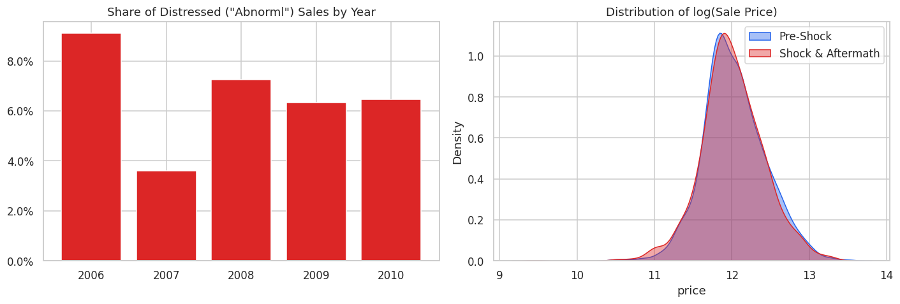
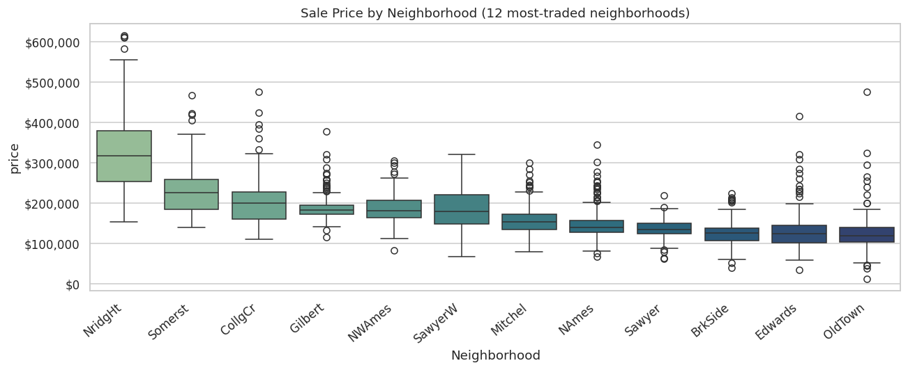
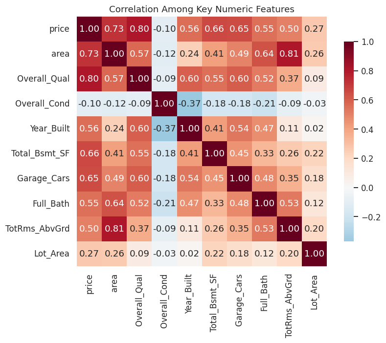
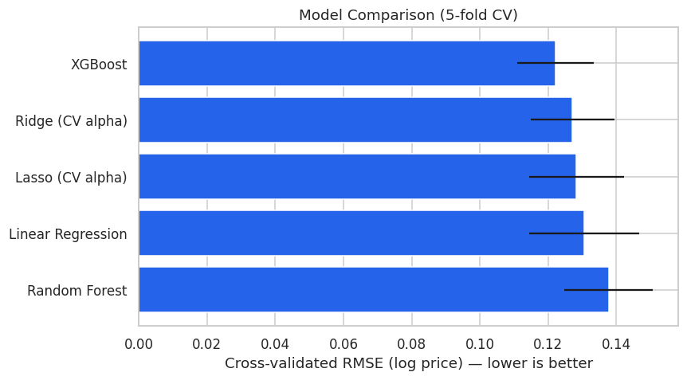
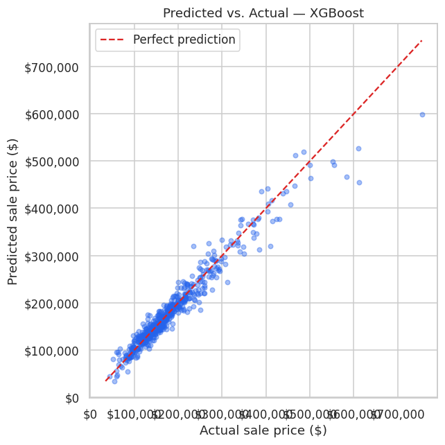
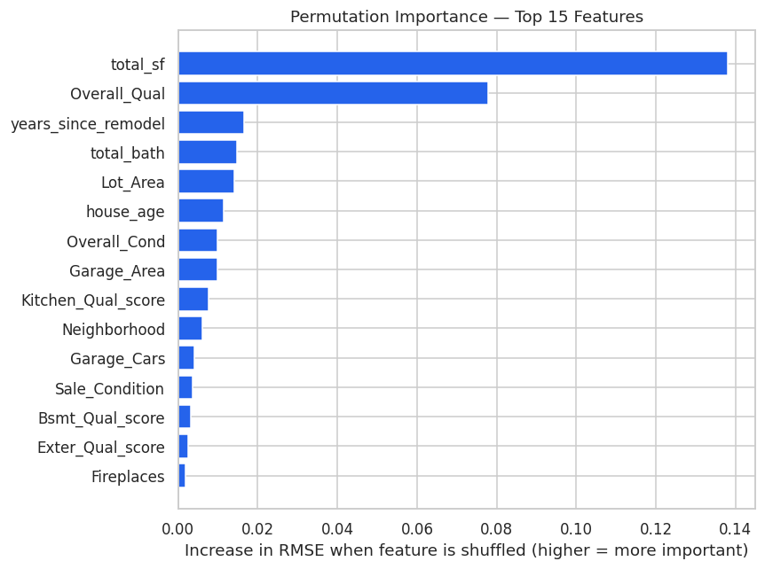
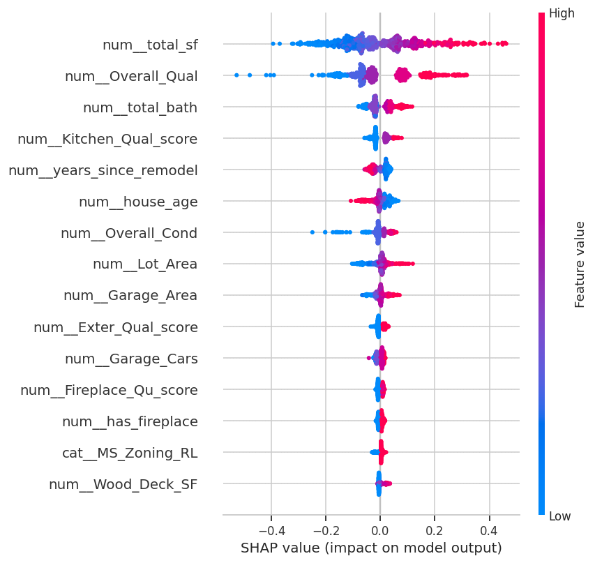

# Boom, Bust, Rebuild: How the 2008 Shock Reshaped the Ames Housing Market

**A structural-break analysis and price model for the Ames, Iowa housing market (2006–2010)**

[](https://www.kaggle.com/code/ehsanghoreshi/boom-bust-rebuild-the-2008-shock-and-the-ames-h)


This project extends a policy-shock lens — the same lens used in a companion project, *Berlin Real Estate: Policy-Shock Analysis & Price* — to the most consequential housing shock in modern U.S. history: the 2008 financial crisis.

Most public notebooks on this dataset stop at "predict `SalePrice`." This one asks a sharper question first:

> **Did the crisis only lower prices, or did it change the *rules* the market prices by** — i.e. did the dollar value of an extra square foot, or of a quality point, shift once the shock hit?

## Data

The [Ames, Iowa housing dataset](https://raw.githubusercontent.com/vincentarelbundock/Rdatasets/master/csv/openintro/ames.csv) (De Cock, 2011) — 2,930 residential sales, 2006–2010, 82 features. This is the dataset behind Kaggle's classic *House Prices – Advanced Regression Techniques* competition, in its fuller original form. The notebook downloads it automatically; no manual step is required.

## Method

1. Load and clean the data — missing categorical values are recoded as an explicit `"None"` category where a missing value means the house simply doesn't have that feature (no pool, no alley access, no fireplace…), rather than being imputed away.
2. Define the shock window at the Lehman Brothers collapse (**September 15, 2008**) and explore price and sale-condition trends around it.
3. Test for a **structural break**, not just a level shift, with a regression that interacts sale timing (`post`) with living area and overall quality:

   ```
   log(price) = β0 + β1·area + β2·post + β3·(area × post) + β4·qual + β5·(qual × post) + ε
   ```

   A significant interaction coefficient (β3 or β5) means the crisis didn't just move the price level — it changed the *slope*: the premium buyers were willing to pay per square foot or per quality point.
4. Engineer features (consolidated size, age, quality-score, and shock-window indicators) and build a price-prediction pipeline comparing Linear, Ridge, Lasso, Random Forest, and XGBoost, all scored with 5-fold cross-validated RMSE on log price.
5. Interpret the winning model with permutation importance and SHAP, and connect the drivers back to the structural-break finding.

## Key results

**A real structural break, hidden under a flat headline price.** Median sale price barely moved (-1.3%, \$162,000 → \$159,900), but the interaction regression found a significant **flight-to-quality** shift: the price premium per 1,000 sqft *fell* after the shock (coefficient ≈ -0.036, p ≈ 0.038), while the premium per quality point *rose* (coefficient ≈ +0.016, p ≈ 0.025). Buyers became pickier about quality and less willing to pay for raw size — a shift a plain "price fell X%" headline misses entirely.

| Metric | Pre-shock | Shock & aftermath |
|---|---|---|
| Median sale price | $162,000 | $159,900 (-1.3%) |
| Distressed ("Abnorml") sale share | 6.2% | 7.0% |

| Model | Best result |
|---|---|
| Winning model | XGBoost |
| R² (log price, held-out test) | ≈ 0.94 |
| Typical error | ≈ $13,200 (≈ 7.5% MAPE) |

`Overall_Qual`, total living area, and `Neighborhood` dominate both permutation importance and SHAP — consistent with hedonic pricing theory. The shock indicator itself is a minor *direct* driver in the prediction model, even though the interaction test shows it reshapes the *slopes* other features are priced on: the two analyses answer different questions, and both were needed.

### Figures

| | |
|---|---|
|  |  |
|  |  |
|  |  |
|  |  |

## Limitations

- Ames, Iowa is a stable Midwest college-town market that under-reacted to the 2008 shock relative to bubble markets (parts of California, Florida, Nevada) — these conclusions should not be generalized nationally without re-running the same pipeline on a bubble-market dataset.
- No macro variables (mortgage rates, local unemployment) are merged in yet — see *Next step* below.
- The interaction regression uses a single break date (Lehman, Sep 2008); a rolling or multiple-breakpoint test (e.g. a Chow test at several candidate dates, or a Bai–Perron test) would confirm whether this specific date is in fact the best-fitting break.

## Next step

Merge in the 30-Year Fixed Mortgage Rate series from FRED (`MORTGAGE30US`) by sale month, and re-run the structural-break test controlling for the rate directly — this separates *credit-cost* effects from *sentiment/distress* effects during the crisis.

## Project structure

```
.
├── notebooks/
│   └── boom-bust-rebuild-the-2008-shock-and-the-ames-h.ipynb   # full analysis, end to end
├── reports/
│   └── figures/                                                 # charts extracted from the notebook
├── requirements.txt
└── README.md
```

## Running it locally

```bash
git clone https://github.com/Ehsan-Ghoreishi/ames-housing-2008-shock.git
cd ames-housing-2008-shock
python -m venv .venv && source .venv/bin/activate   # Windows: .venv\Scripts\activate
pip install -r requirements.txt
jupyter notebook notebooks/boom-bust-rebuild-the-2008-shock-and-the-ames-h.ipynb
```

The notebook downloads the dataset automatically on first run (no manual download or Kaggle account needed) and caches it under `data/`.

You can also run it directly on Kaggle via the badge at the top of this README — open **Notebook settings → Internet → On** and run top to bottom.

## License

Released under the [MIT License](LICENSE).
